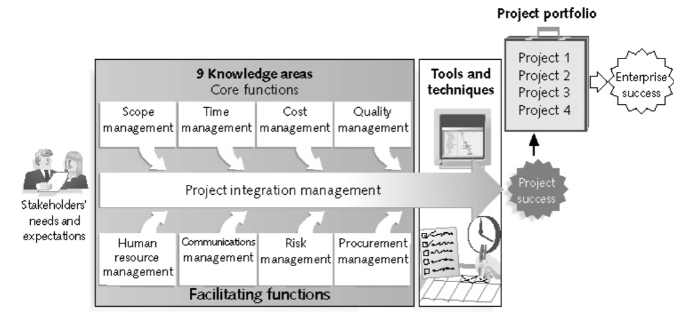
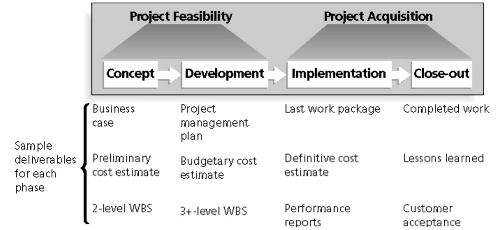
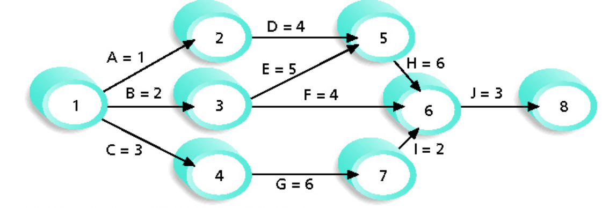
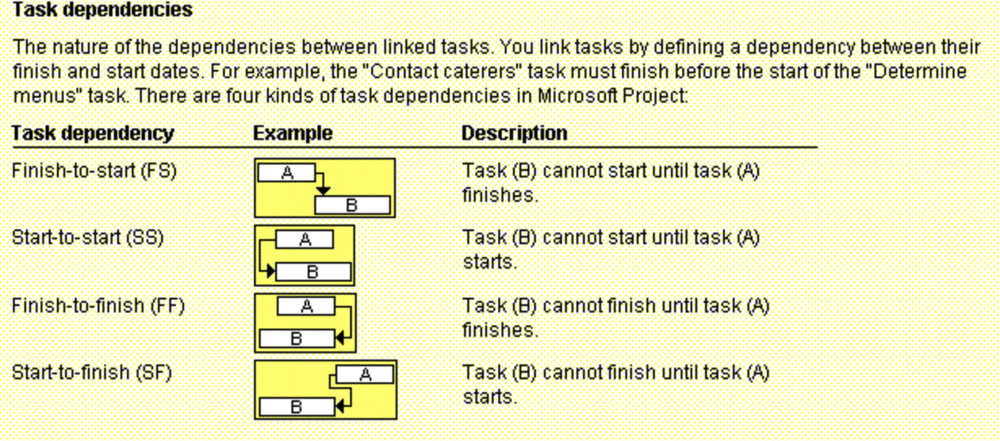

### CH1-项目管理概述

#### 项目管理好处

- Better control of financial, physical, and human resources
- Improved customer relations
- Shorter development times
- Lower costs
- Higher quality and increased reliability
- Higher profit margins
- Improved productivity
- Better internal coordination
- Higher worker morale

#### 项目的定义 ★

为创造一个特定的产品、服务或者成果而采取的临时性努力

#### 项目属性 ★

- 有特定目的
- 临时性
- 不断完善细节而逐步开展
- 需要不同领域资源
- 有主要客户或发起人
- 有不确定性

#### 项目约束 ★

范围、时间、成本

#### 项目管理的定义 ★

在项目活动中运用专门的知识、技能、工具和技术，以满足项目需求。

#### 项目管理知识领域 ★

##### 四个核心

​	范围-Scope	成本-Cost	时间-Time	质量-Quality

##### 四个辅助 

​	人力-HumanResource	采购-Procuremen	沟通-Communications	风险-Risk

##### 集成管理-Integration

##### 干系人管理-Stakeholders

#### 成功项目管理

#### 项目干系人的定义

Stakeholders

参与项目获受项目活动影响的人

项目发起人、项目团队、支持人员、客户、使用者、供应商、甚至是项目的反对者

#### 项目管理人人员所需技能

1. 项目管理知识体系
2. 应用领域知识、标准和法规
3. 项目环境知识
4. 一般管理知识和技能
5. 软技能或人际关系技能

#### 相关术语

**PMI-项目管理协会**

美国的国际性项目管理专业协会

**PMO-项目管理办公室**

企业中的有组织的团队

**PMP-项目管理师**

PMI提供的认证

### CH2-项目管理和IT背景

简单了解

#### 三球模型

业务、组织、技术

#### 可交付成果 ★

是一个产品或者服务

#### 项目生命周期

记得区分**项目管理过程组（CH3）**

概念 -> 开发 -> 实施 -> 收尾

#### 产品生命周期

**SDLC - Systems Development Life Cycle**

瀑布式、螺旋式、渐增式、RAD（快速应用开发）

**ASD - 自适应软件开发**

**敏捷软件开发**

#### 产品开发的组织结构

- 职能型 - 按职位
- 项目型 - 按项目
- 矩阵型 - 按职能下划分职位

#### 项目激励的方法

马斯洛激励理论

需求层次理论：生理需求 安全需求 归属需求 尊重需求 自我实现(塔顶)

### CH3-案例研究

#### 过程

针对某一特定结果的的一系列行动

#### 项目管理过程组 ★

五阶段

- 启动阶段 - initiating
- 计划阶段 - planning
- 执行阶段 - executing
- 监控阶段 - monitoring and controlling
- 收尾阶段 - closing

**执行阶段花费时间最多**

### CH4-项目综合管理

章程 计划

#### 项目综合管理主要流程

1. 制定项目章程
2. 开发项目管理计划
3. 指挥并管理项目执行
4. 监控项目工作
5. 综合变更控制
6. 项目或阶段收尾

#### NPV-净现值分析 ★ 🧮

计算预期净货币收益或损失的方法

会计算NPV ROI（投资回报率）

NPV = 每年净收入 * 当年折现因子 的总和

折现因子 = 1 / (1 + 折现率)^ 当年年份

ROI = （折现收益总额 - 折现成本总额）/ 折现成本

#### 项目中的变更控制

主要的**项目工具**：

变更管理系统、配置管理系统、项目管理信息系统、工作授权系统

变更控制系统CCS

变更控制委员会**CCB**

**配置管理**是综合变更控制的一个重要部分（结合**质量管理**）

​	确保关于项目产品的描述是正确且完整的

### CH5-项目范围管理

#### 范围	Scope

开发项目产品所涉及的所有工作和用来开展工作的所有过程

#### 项目范围管理

1. 制定范围管理计划

2. 收集需求

3. 定义范围

4. 创建工作分解结构WBS

5. 验证范围

   ​	指可交付成果的正式接受

6. 控制范围

#### WBS

**制定方法**

- 使用指南
- 类比法
- 自上而下
- 自下而上
- 思维导图

**WBS字典**

WBS内容简短，配合描述WBS的详细信息

**工作包**

WBS的最低层次

### CH6-项目进度管理 ★

有7个主要的过程

- 计划进度管理
- 定义活动
- 排序活动

- 估算活动资源
- 估算活动工期
- 制订进度计划
- 控制进度

#### **活动清单**

包含在项目进度中的活动列表

#### **活动属性**

与进度相关的更多信息，例如前导活动、后继活动、逻辑关系、提前、滞后、资源需求、约束、强制日期、相关假设。**与WBS和WBS字典保持一致**。

#### **里程碑**

一个**没有工期**的重要事件

**SMART准则**

- Specific 明确的
- Measurable 可度量的
- Assignable 可分配的
- Realistic 现实的
- Time-framed 有时间限制的

#### **三种依赖**

强制依赖、自由依赖、外部依赖

工作中的内在关系、项目定义的活动之间关系、非项目活动和项目之间的关系

#### **网络图**

使用**双代号网络图AOA**或**箭线图法ADM**

箭头表示活动顺序前后，数字表示任务需要天数

​			

#### **前导图法PDM**

优点：

- 多数管理软件使用PDM
- 避免虚活动的使用
- 表示了不同依赖，AOA只有完成-开始依赖

#### 		

​		

#### 甘特图的符号

黑色线——概要任务（无需估算工期）

黑色菱形——里程碑

箭头线——依赖关系

长方形——汇总任务

#### 资源估算

**参数估计法**

**三点估计法**

乐观，悲观，最可能的估算

#### 关键路径

决定了项目**最早完成时间**的一系列活动，是项目的最长路径，拥有**最少**的时差或浮动时间

**时差或浮动时间**

在不延误后继活动或者项目完成时间的情况下，任务可以腿后的时间

#### 关键路径法CPM ★ 🧮

把每个通过网络图的路径上将工期累加起来。最长路径是关键路径。

#### ES、EF、LS、LF ★ 🧮

先算关键路径，没有浮动

正推法计算ES、EF

倒推法计算LS、LF

**总时差**

**LS - ES** 或 **LF - EF**

**自由时差**

min{ES1-EF0,ES2-EF0,...},1号活动和2号活动都在0号活动之后

